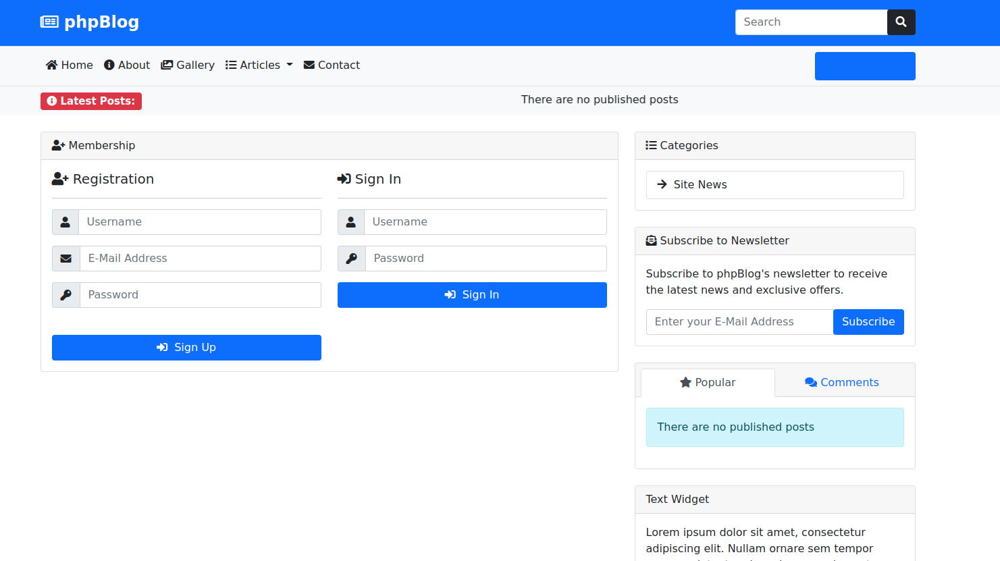
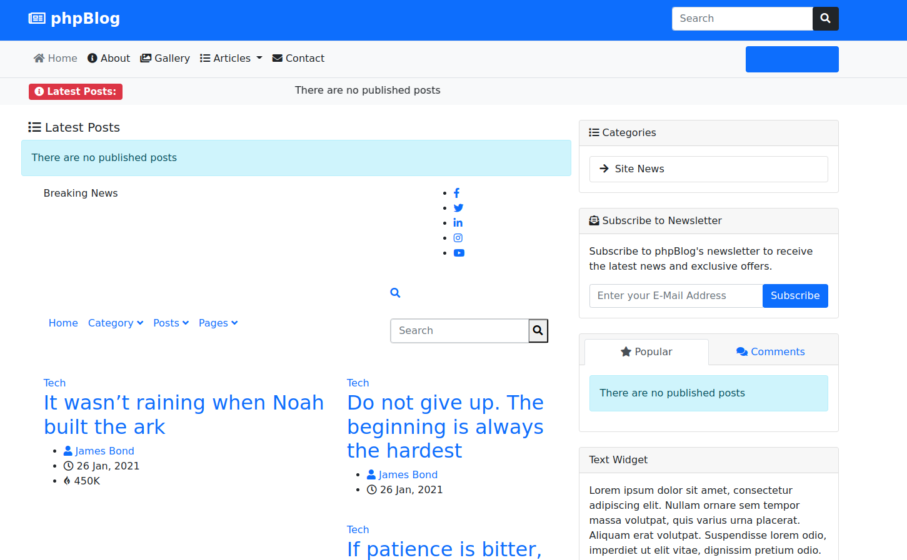

#  Php Blog Project

## Description

### This project allow post news in the web, login, singup and signin. Also the users can createnew articles and publish in real time

## Requirements

+ Phpmyadmin (Any Database Manager Works)

+ XAMPP 

+ Only turn on your apache server and use this app

# Instructions

### You must have configure it the database credentials with user, password, host and database. **In the config file**

# Link

[Direct Acces Repository](https://github.com/userlg/php-blog-news)

# Screenshots

_____________________________________________________

____________________________________________________

